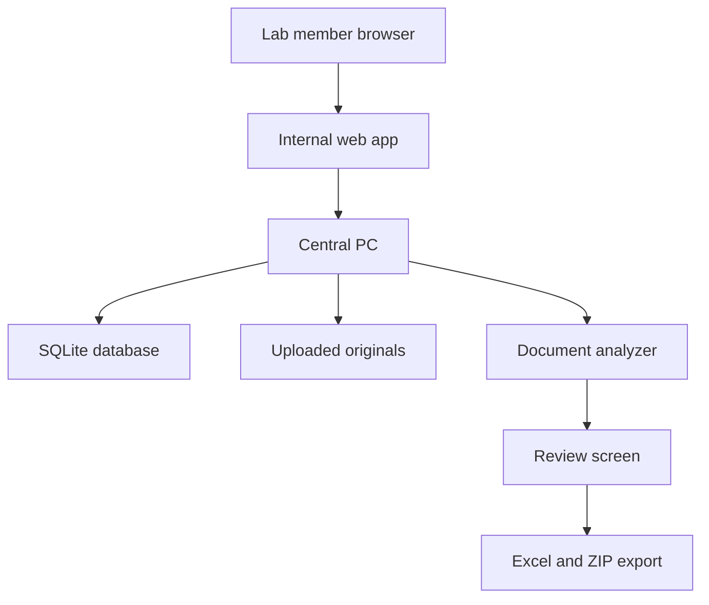

# Architecture

## Concept

Lab Trip Docs is a small internal web app that runs on one central lab PC.



## Components

| Component | File | Role |
|---|---|---|
| Web server | `tripdoc/web.py` | HTTP routes, upload forms, review UI |
| Database | `tripdoc/store.py` | SQLite schema and queries |
| Analyzer | `tripdoc/analyze.py` | Text extraction, category detection, traveler matching |
| Exports | `tripdoc/exporters.py` | Excel, person PDF, ZIP generation |
| Config | `tripdoc/config.py` | Host, port, data directory, auth settings |

## Data Layout

```text
data/
  app.db
  uploads/
    trip-1/
      original-files
  exports/
    trip-1/
      trip-summary.xlsx
      trip-package.zip
```

## Security Model

This is an internal MVP. It uses Basic Auth and stores files on the central PC. Do not expose it directly to the public internet. Use a school VPN or a private overlay network if off-campus upload is needed.

